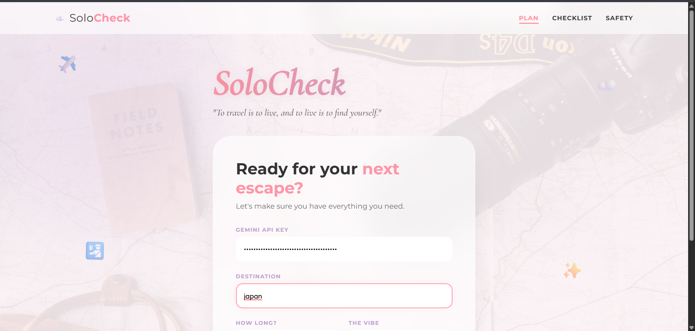
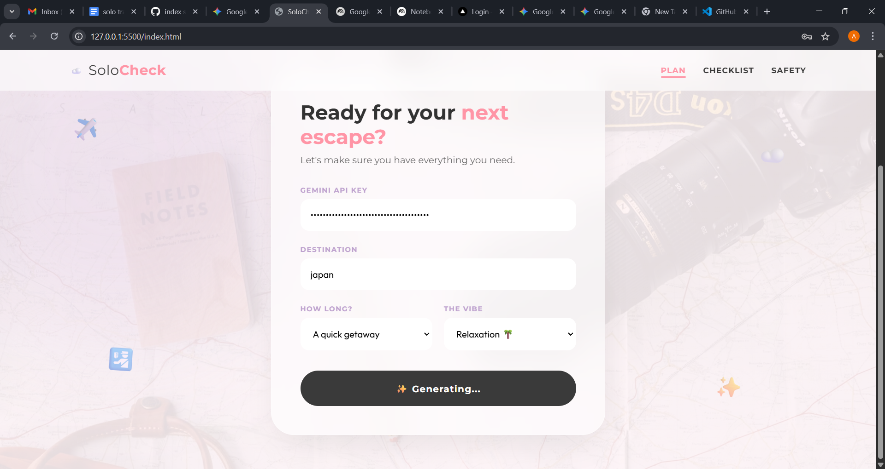
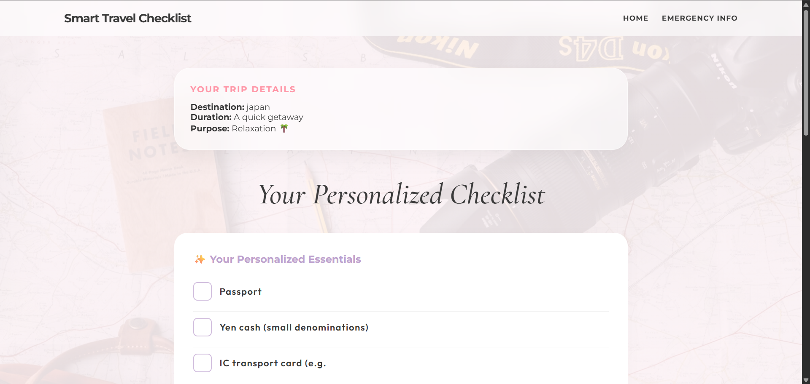
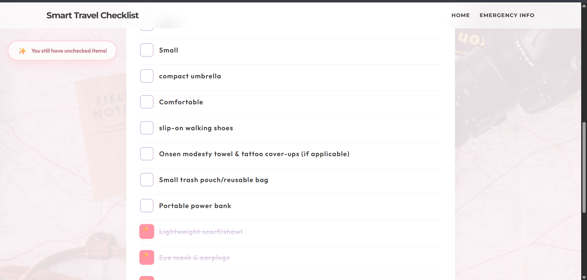
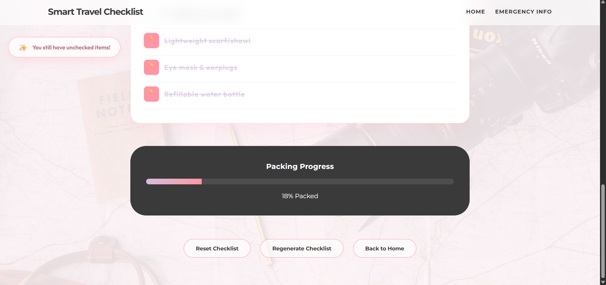
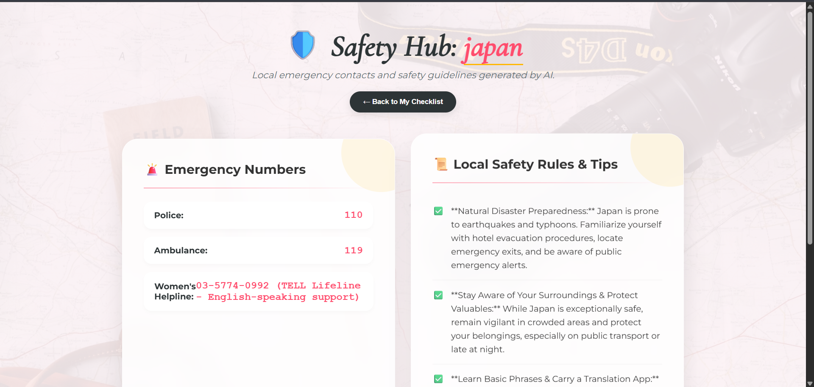
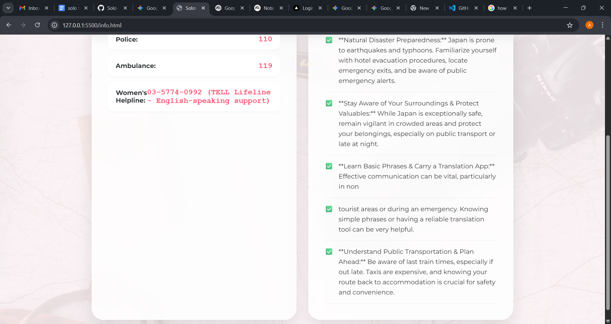

# SoloCheck 

---

## Basic Details

**Team Name:** Cinol Team

### Team Members
- Member 1: Cinol Samson - Rajiv Gandhi Institute of Technology,Kottayam
- Member 2: Annu Shaji - Rajiv Gandhi Institute of Technology,Kottayam

---

## Hosted Project Link

[Add your deployed link here – Netlify / Vercel / GitHub Pages]

---

## Project Description

SoloCheck is an AI-powered smart travel checklist generator that creates a personalized packing list based on destination, trip duration, and travel purpose. It also provides local emergency contacts and safety guidelines to help travelers stay prepared and safe.

---

## The Problem Statement

Travelers often forget essential items while packing and rely on generic checklists that do not match their specific trip type. Additionally, they may lack awareness of emergency contacts and safety precautions in unfamiliar destinations.

There is no simple, lightweight, AI-powered assistant that instantly creates a customized travel checklist.

---

## The Solution

SoloCheck solves this by:

- Using Google Gemini AI to generate personalized packing checklists
- Customizing suggestions based on trip details
- Tracking packing progress visually
- Saving checklist state using LocalStorage
- Providing emergency numbers and local safety tips
- Offering a clean and interactive user experience

---

# Technical Details

## Technologies/Components Used

### For Software:

**Languages used:**
- HTML5
- CSS3
- JavaScript (ES6)

**Frameworks used:**
- None

**Libraries used:**
- Google Generative AI (Gemini API)

**Tools used:**
- VS Code
- Git
- GitHub
- Browser DevTools

---

# Features

### Feature 1: AI-Powered Checklist Generation
Generates a custom travel packing list using Gemini AI based on user input.

### Feature 2: Dynamic Progress Tracking
Calculates packing completion percentage and updates progress bar in real time.

### Feature 3: Safety Hub
Displays emergency contacts and local safety guidelines for the destination.

### Feature 4: Persistent Data Storage
Saves checklist progress using LocalStorage even after page refresh.

---

# Implementation

## For Software:

### Installation

1. Clone the repository
   git clone https://github.com/Annu0456/Solo-traveller-check-list.git

2. Navigate to the project folder
   cd Solo-traveller-check-list

3. Open the project in your code editor (VS Code recommended).

### Run

Since this is a frontend-only application, no backend setup is required.

To run locally:

Open the index.html file in your browser
OR

Use Live Server in VS Code

The application will run directly in the browser.

The deployed version is hosted on Vercel.


---

# Project Documentation

## For Software:

## Screenshots 

### 1️⃣ Trip Planner Page





This page allows users to enter their destination, trip duration, travel vibe, and Gemini API key to generate a personalized checklist.

---

### 2️⃣ AI Generated Checklist Page







 
Displays AI-generated packing items, progress tracker, reminder banner, and reset functionality.

---

### 3️⃣ Safety Hub Page






Shows emergency contact numbers and local safety tips for the selected destination.

---

# Diagrams

## System Architecture

```text
User Input (Destination, Duration, Vibe)
        ↓
Frontend Form (index.html)
        ↓
Gemini API Call (script.js)
        ↓
AI Generated Checklist
        ↓
LocalStorage
        ↓
Checklist Page Rendering
        ↓
Progress Tracking + Safety Hub


### Architecture Explanation

- User enters trip details
- JavaScript sends prompt to Gemini API
- AI returns formatted checklist
- Data is stored in LocalStorage
- Checklist page dynamically renders items
- Progress and safety modules enhance usability

---

## Application Workflow

1. User opens planner page
2. Enters trip details
3. AI generates checklist
4. User checks items while packing
5. Progress bar updates
6. User views safety information

 This workflow ensures smooth travel preparation from planning to safety awareness.

---

## Additional Demos

- Live Site: [Add hosted link]
- GitHub Repository: https://github.com/Annu0456/Solo-traveller-check-list.git


---

# AI Tools Used (Transparency Section)

**Tool Used:** ChatGPT,Gemini
**Purpose:**  
- UI structuring  
- Debugging assistance  
- Prompt engineering for Gemini API  

**Tool Used:** Google Gemini API  
**Purpose:**  
- Generating personalized travel checklists  

**Key Prompts Used:**
- "Design a reminder system for unchecked checklist items."
- "Create a progress bar logic for checklist completion."
- "Suggest UI improvements for travel planner page."

**Percentage of AI-generated code:** ~70–80%

---

# Human Contributions

- Full UI/UX design
- Business logic implementation
- AI integration
- LocalStorage state management
- Testing and debugging

---

# Team Contributions

**Annu Shaji:**
- Frontend development
- UI/UX design
- Documentation

**Cinol Samson:**
- Testing
- Safety Hub logic
- AI integration
- Presentation preparation

---

# License

This project is licensed under the MIT License.

---

